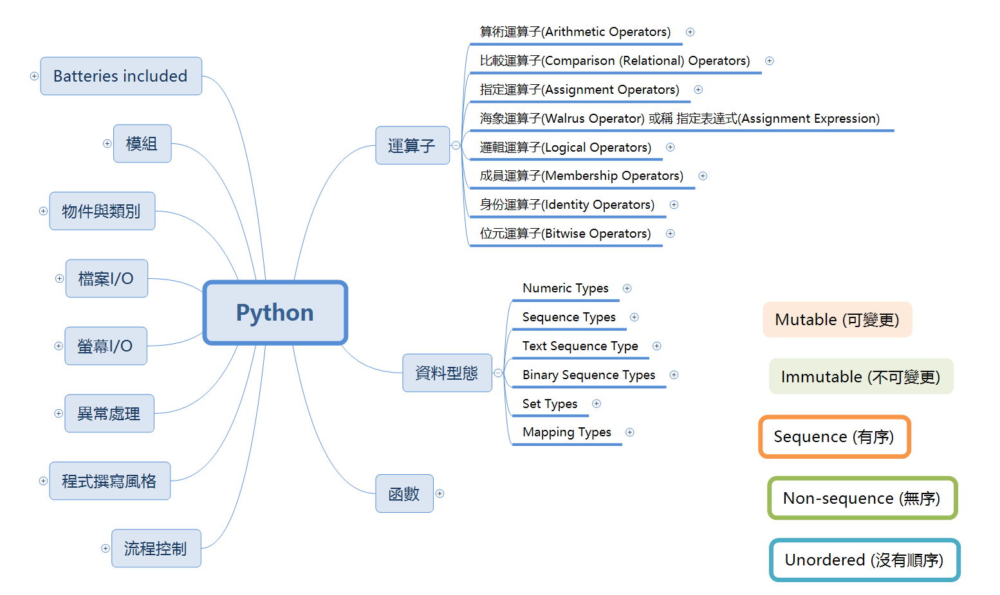

# Python 基礎學習心智圖

[✅下載心智圖](materials/python.xmind)

# 重要分類：
1. [運算子](materials/operator.md)
1. [資料型別/資料型態](materials/type.md)
    1. [Numeric Type](materials/type_numerical.md)
    1. [Sequence Types](materials/type_sequence.md)
    1. [Text Sequence Type](materials/type_text_sequence.md)
    1. [Binary Sequence Types](materials/type_binary_sequence.md)
    1. [Set Types](materials/type_set.md)
    1. [Mapping Types](materials/type_map.md)
1. 程式撰寫風格
1. 流程控制
1. 函數
1. 螢幕I/O
1. 檔案I/O
1. 異常處理
1. 模組
1. 類別

# 技術文章
1. [Python的字串處理](article/001_string.md)